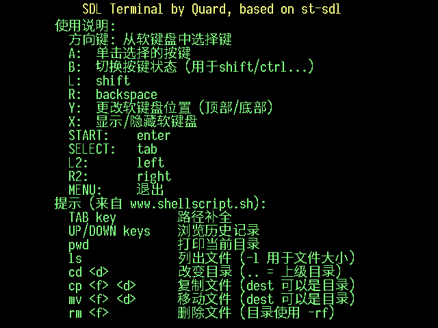

# rg35xx-app-st

从 https://github.com/leonkasovan/st fork而来的Simple terminal，为rg35xx GarlicOS编译，并添加了自己的一些修改，代码尊重原本的开源协议。构建体系从 https://github.com/QQxiaoming/rg35xx-app-template fork而来，依然遵循原本的开源协议。

## 修改点

- 菜单提示帮助修改为中文
- 字体更新为等宽字体
- 渲染界面更新为640x480，更加清晰
- 支持utf8编码，可以在终端显示中文
- 增加音量+显示帮助
- 增加音量-截图
- 修复capslock键使用B锁定后，无法解锁卡死的问题

## 截图

|   |
| :-------------------------: |
|   |
|   |

